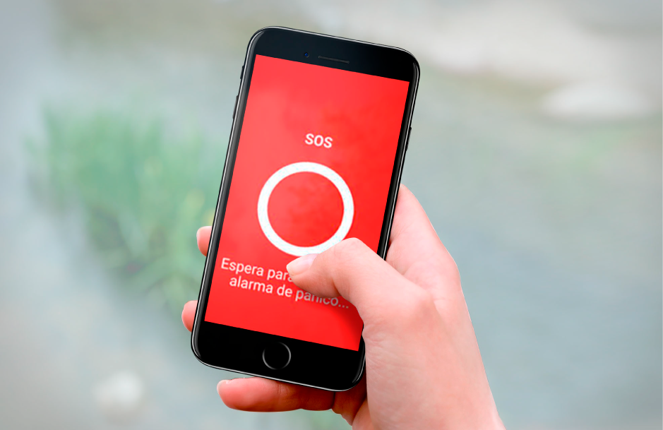
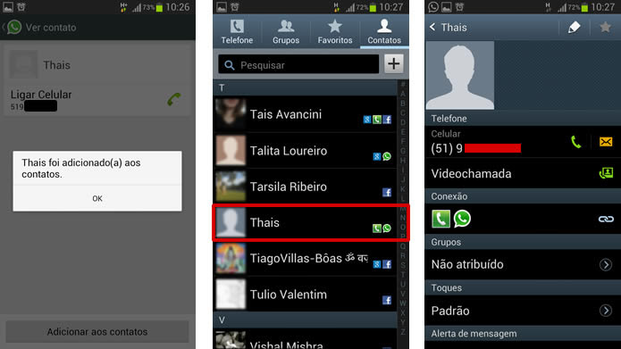

# ⚠️  Total Panic ⚠️

# Objetivo

Total Panic é um aplicativo mobile desenvolvido para garantir uma rede de segurança para motoristas, ele conta com uma interface simples e intuitiva
na qual o usuário pode cadastrar contatos para momentos de crise, como assaltos e sequestro, com um simples click, ele aciona todos os membros cadastrados
com uma mensagem de texto informando sua localização e horário continuamente de modo discreto, ou seja sem causar alterações em seu aparelho local.

Além disto disponibilizamos um modulo desenvolvido no arduino de botão físico, que simula o mesmo comportamento da aplicação digital. 

## Instalação

A instalação pode ser feita pela [Play Story](), ou [F Droid]()
### Download:
  - [Play Story]()
  - [F Droid]()

## Utilização

1. Inicialmente cadastre em nosso app uma rede de contatos confiáveis:

;

2. Caso esteja em perigo acione nosso botão: 

3. Ou Aparte nosso widget de emergência: 

## Duvidas 
Para duvidas e mais informações visite nosso [site]()

## Motivação  
Este projeto foi desenvolvida para disciplina Usina de  Projetos Experimentais da Faculdade Newton Paiva

## Autores 
  - Maria Isadora
  - Hugo Oliveira Santos Librelon 
  - Matheus Arold Ribeiro
  - Matheus Lucas Bretas
  - Randolfo Augusto Gonçalves

## Licença 
 - [GNU](gpl-3.0.md)
