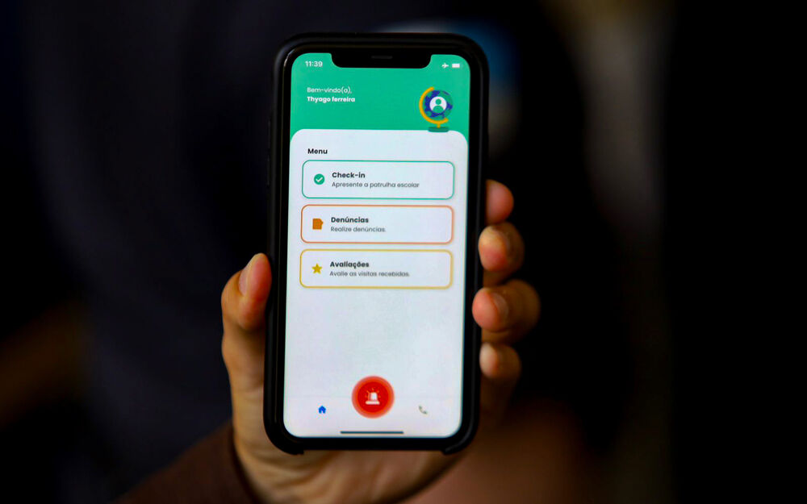
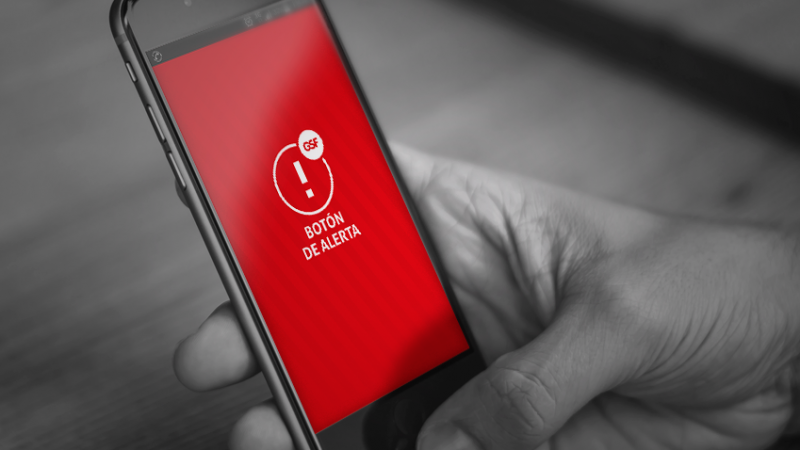

# ⚠️  Total Panic ⚠️

Total Panic é um aplicativo mobile desenvolvido para garantir uma rede de segurança para motoristas, ele conta com uma interface simples e intuitiva
na qual o usuário pode cadastrar contatos para momentos de crise, como assaltos e sequestro, com um simples click, ele aciona todos os membros cadastrados
com uma mensagem de texto informando sua localização e horário continuamente de modo discreto, ou seja sem causar alterações em seu aparelho local.

Além disto disponibilizamos um modulo desenvolvido no arduino de botão físico, que simula o mesmo comportamento da aplicação digital. 

## Instalação

A instalação pode ser feita pela [Play Story](), ou [F Droid]()
### Download:
  - [Play Story]()
  - [F Droid]()

## Utilização

1. Inicialmente cadastre em nosso app uma rede de contatos confiáveis:

;

2. Caso esteja em perigo acione nosso botão: 

3. Ou Aparte nosso widget de emergência: 

## Duvidas 
Para duvidas e mais informações visite nosso [site]()

## Contributing
State if you are open to contributions and what your requirements are for accepting them.

For people who want to make changes to your project, it's helpful to have some documentation on how to get started. Perhaps there is a script that they should run or some environment variables that they need to set. Make these steps explicit. These instructions could also be useful to your future self.

You can also document commands to lint the code or run tests. These steps help to ensure high code quality and reduce the likelihood that the changes inadvertently break something. Having instructions for running tests is especially helpful if it requires external setup, such as starting a Selenium server for testing in a browser.

## Authors and acknowledgment
Show your appreciation to those who have contributed to the project.

## License
For open source projects, say how it is licensed.

## Project status
If you have run out of energy or time for your project, put a note at the top of the README saying that development has slowed down or stopped completely. Someone may choose to fork your project or volunteer to step in as a maintainer or owner, allowing your project to keep going. You can also make an explicit request for maintainers.

